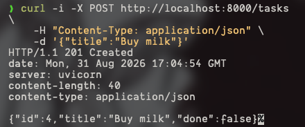
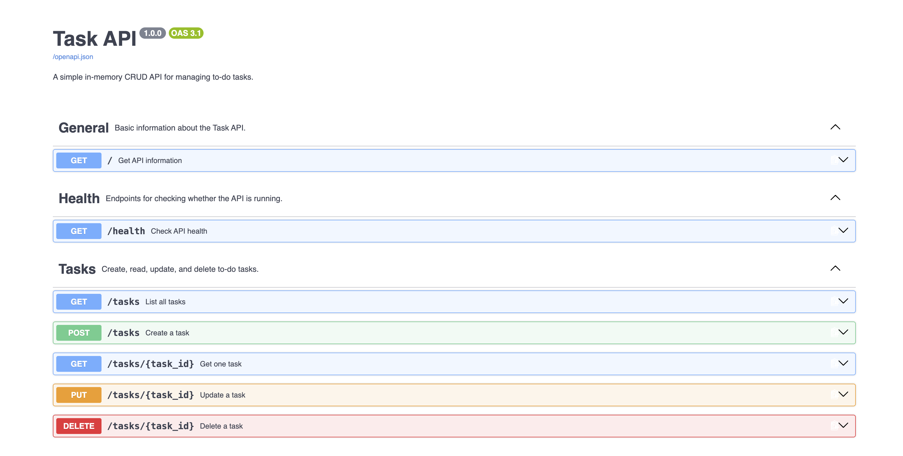

# Task API

A small in-memory CRUD API for managing to-do tasks. Built with FastAPI for
the FlyRank Week 2 backend assignment.

## Install and run

Requires Python 3.10 or newer.

```bash
git clone <your-repository-url>
cd crud_api
python3 -m venv .venv
source .venv/bin/activate
pip install -r requirements.txt
uvicorn src.main:app --reload
```

Open <http://localhost:8000/> to see API information, or visit
<http://localhost:8000/health> to check that the server is running.

Interactive API documentation is available at <http://localhost:8000/docs>.

## Endpoints

| Method | Path | Description |
| --- | --- | --- |
| GET | `/` | API information |
| GET | `/health` | Server health check |
| GET | `/tasks` | List all tasks |
| POST | `/tasks` | Create a task |
| GET | `/tasks/{task_id}` | Get one task |
| PUT | `/tasks/{task_id}` | Update a task's title and/or completion status |
| DELETE | `/tasks/{task_id}` | Delete a task |

## curl example

Request:

```bash
curl -i http://localhost:8000/health
```

Response:

```http
HTTP/1.1 200 OK
content-type: application/json

{"status":"ok"}
```



## Swagger UI

Interactive API documentation is available at <http://localhost:8000/docs>.
It is organized into **General**, **Health**, and **Tasks** sections.


